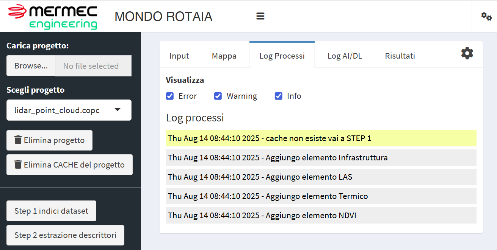

# Mer Mec Engineering - Mondo Rotaia

Vedi [Installazione](#installazione)



## Installazione

Installa nell'ambiente R che le seguenti righe

```r

## installa la funzione 'remotes' se non già presente; consente di installare il sistema

if (!requireNamespace("remotes", quietly = TRUE)) {
  install.packages("remotes")
}

remotes::install_github("fpirotti/MermecDeepL4Veg")


```
